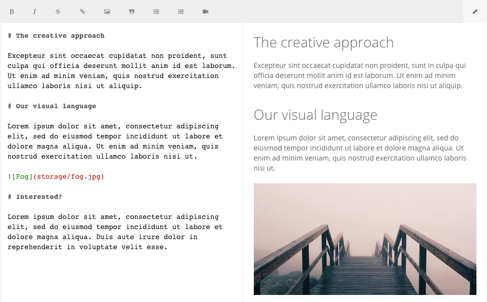
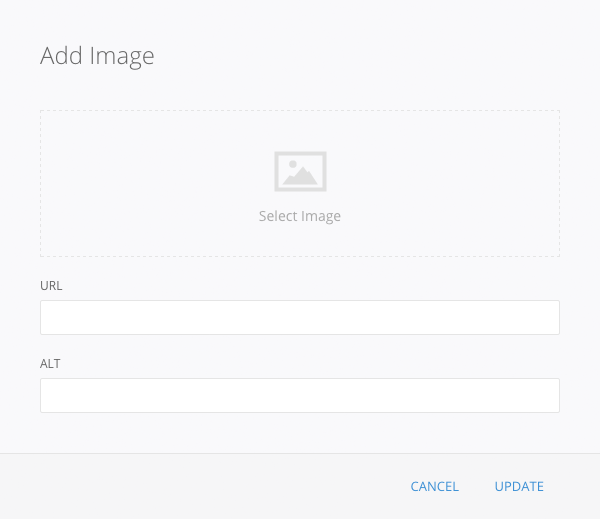
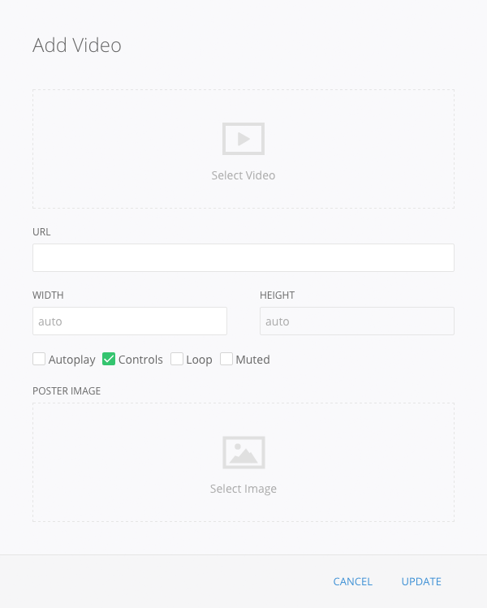
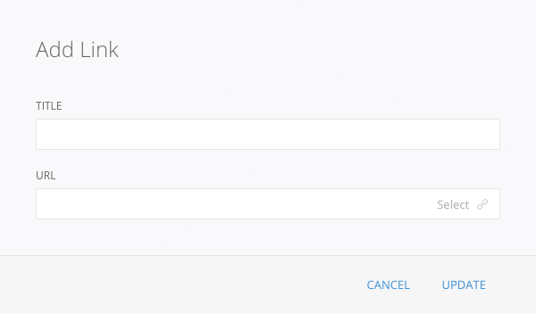

# The Editor

Let's introduce you to the the main editing tool you will see in all places: Pagekit's powerful markdown editor.

To edit content, you can write HTML with some autocompletion aid or use the popular [markdown syntax](http://daringfireball.net/projects/markdown/syntax). You can even include HTML snippets in markdown. In the top right corner you see an arrow icon to enter *full screen mode*. If you are on a large enough screen, you will see a side by side view of your content source on the left and the rendered preview on the right. On smaller devices, this will be displayed in two separate tabs.

To define how the content is rendered, you can enable or disable markdown with the *Markdown* checkbox below the editor.

Above the content field you see a toolbar for the most frequent formatting tasks. Choose text styles, insert links, quotes, lists and media elements. Depending on the current editor mode, the toolbar will automatically insert HTML or Markdown snippets.

## Insert Images
To insert an image, just click the _image_ icon and a modal will appear where you can choose a picture from the Storage. When the Storage dialog is open, you can also drag and drop the desired image file from your local file browser. Once the image was chosen, click the update button and the image text will appear at the current cursor position.

**Note** You can always open the dialog again by placing the cursor on the content to be edited and clicking on the toolbar icon.

## Inserting Videos
Just like with images, inserting a video is as simple as clicking the _video_ icon and using the modal dialog.

## Inserting Links
To insert a link select the text you want to link and click on the _link_ icon from the toolbar. You can also insert an link without selecting any text in which case the title will be used as the link text.

## Text Editing
The remaining toolbar icons are for other frequent text editing tasks. Just select the text to be edited and click on the desired icon to apply its style.
