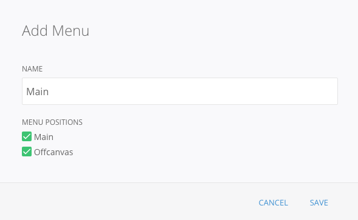
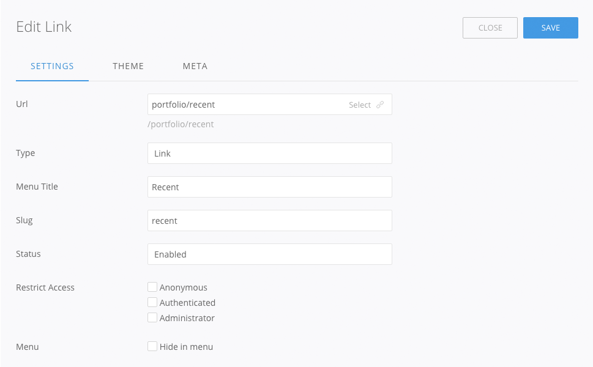
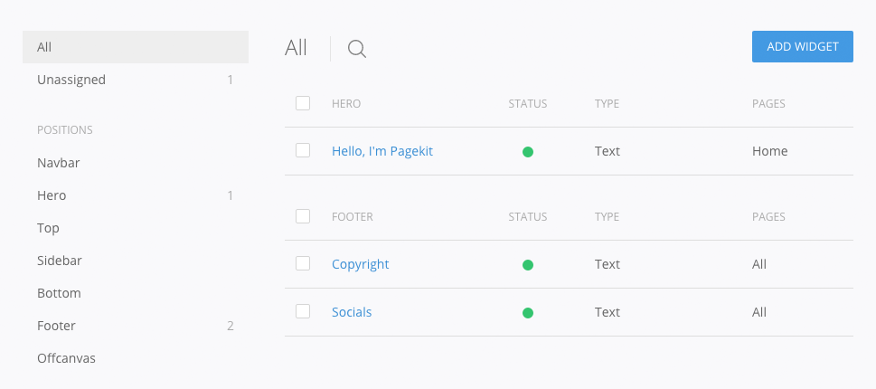

# Site

The Site Tree allows you to manage your site's content and structure, all in a single drag-and-drop interface. This is also the area where you manage all of your Widgets.

## Menus
You can see an overview of all menus on the left and their assigned pages on the right. Hover a single entry to see an _edit_ and _remove_ button for that menu. New menus can be created by clicking on the _Add Menu_ button. You can use these for actual Menus you render on the site. However, you can also use these to just group content from your site for easier management in the admin area.

Each menu linked pages are displayed on the right. Pages without a menu are listed in the _Not Linked_ view, while trashed pages are listed in the _Trash_ view, both accessible below the menus list.

## Render a menu on your site

When you hover over a menu and lick the *Edit* icon, a modal dialog will appear. Besides renaming the menu, you can also assign it to any number of menu positions that are defined by your theme. In the following screenshot, the Menu will be rendered both in the main menu position of the site and in the mobile off-canvas position.

## Pages
Menu pages can be managed on the right side of the interface. This is a tree view which means that it shows the hierarchical structure of your page. It can be sorted via drag-and drop. You can enable/disable single items by clicking on the green or red circle in the status column. This will make them appear/disappear in the rendered menu but also make the links unavailable if anyone accesses a URL manually.

In front of every item you see a checkbox. Select one or multiple pages to show a toolbar which offers several quick tasks. Move pages, delete them or change the enabled status for multiple items at once.

To create a new page click on the _Add Page_ top right button and choose the type of page you want to create. Pagekit comes with a few pre-defined ones - any extension can add new types to that list. You can also edit existing pages by clicking on their title in the Site Tree. This will lead you to an edit screen which will look different, depending on the type of the item you clicked on.

### Type: Pages

Pages are basically the equivalent to a static webpage. Typically you would use pages for content like an _About Us_ or _Contact_ page. For editorial content however, you would rather make use of blog posts.

In the **Content** tab you can edit the page main content, such as the article body, title and slug. Additionally you can set the Menu title which will be displayed in the frontend Menu as well as the page status and access limitations for certain user roles. The **Settings** tab will display an overview of the page basic settings. Finally, the **Theme** tab holds the theme specific options.

**Note** A slug is a computer friendly version of the title so that it can be included in the absolute URL to the page. If you do not like the generated slug, simply click on it to choose your own.

### Type: Link
Links are the most flexible type as they can create a menu entry linking to any internal or external URL.

In the **Settings** tab the you can manually fill the URL field. You can also use the link picker by clicking the _select_ button. It allows choosing the extension and view which you want to link to. You can set the link type to be a normal link, an alias of another link or a redirect.

**Note** If you are unsure, leave the default type _Link_.

Like with a static page, the tabs **Settings** and **Theme** offer both system and theme specific settings.

## Widgets
Widgets are a way to render small chunks of content in areas defined by the activated theme. A widget's content can be static (like custom HTML, MArkdown or plaintext) or dynamic (like a slideshow generated by one of your installed extensions).

In the _Site > Widgets_ overview the widgets are sorted by the position they are published in. You can Drag & Drop them to change the rendering order inside a position with multiple widgets. Toggle between enabled and published state by clicking the red or green circle in the _Status_ column.

When one or more widgets are selected, a toolbar appears. Here you can change the status of multiple widgets, as well as duplicate, delete or move them to another position. You can also filter the displayed Widgets with the search field at the top of the screen. This may come on handy when working with a large number of Widgets.

**Note** Be careful when deleting the Widgets as there is no trash to recover them once deleted.

Pagekit comes with the pre-defined widget types _Menu_, _Text_ and _Login_, extensions can add widget types of their own.

### Editing
Click on a Widget title to go to its Edit screen. By default, the _Settings_ tab will be selected. The content of this tab will depend on the widget type. A text widget you will have an editor, a menu widget shows options to select a menu and so on. Every widget type has a set of options available on the right side where you can enable or disable the widget, assign it to a widget position in your theme and restrict its access.

The _Theme_ tab offers settings for the widget's appearance. You can choose a panel style (like a box around the widget's content) or add a badge and center the widget's content. Note that these settings are specific to your activated theme. The following screenshot shows what the default theme will offer here.

The _Visibility_ tab allows you to choose which pages the widget will be rendered on. If no pages are selected, it will be rendered on every page.

## Storage

The Storage tab shows the [Finder](finder.md) which allows to manage your file storage and upload files.

## Settings

_Site > Settings > General_ allows to set general information about your site.

Field        | Description
:----------- | :----------------------------------------------------------------
**Title**    | Your site title.
**Logo**     | The logo that will be displayed as part of your site brand.
**Favicon**  | The image that will be used as the browser favicon.
**App Icon** | The icon that will be used when creating an site shortcut in iOS.

_Site > Settings > Theme_ displays settings from the currently selected theme. The _Theme_ tab might not be visible at all if the active theme doesn't offer or require any settings by the user.

_Site > Settings > Code_ allows setting a code in the header and/or footer of your site. This is useful for tracking codes and manual meta tags.

Field      | Description
:--------- | :-------------------------------------------------------------
**Header** | The code you would like to be displayed in the header section.
**Footer** | The code you would like to be displayed in the footer section.

_Site > Settings > Maintenance_ allows putting your site into maintenance mode and display a related message. As an administrator you will still be able to browser your site. Visitors will only see the maintenance message.

Field       | Description
:---------- | :-----------------------------------------------------------------------------------------------
**Offline** | If enabled the site will enter the maintenance mode and display the text from the message field.
**Message** | The message to be displayed when in maintenance mode.
