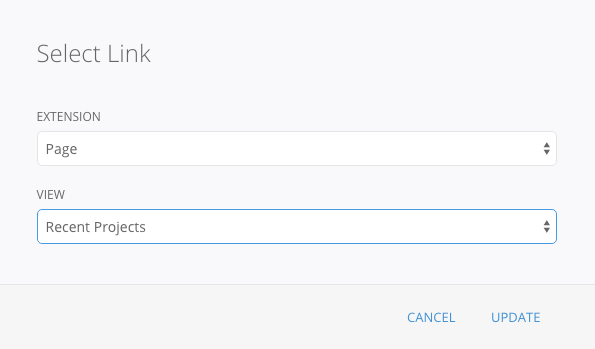
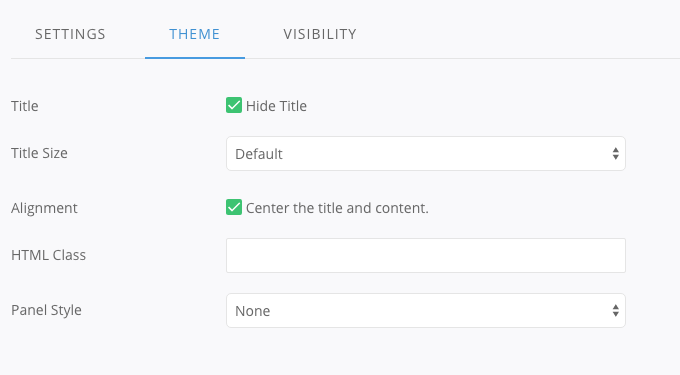

# Site

This area is the heart of your website. Here you can manage pages and menus in a tree view, create and edit widgets, organize all your uploaded media and modify general settings of the site.

<ul class="uk-list">
    <li><a href="#pages-and-menus">Pages and menus</a></li>
    <li><a href="#render-menus">Render menus</a></li>
    <li><a href="#pages">Pages</a></li>
    <li><a href="#widgets">Widgets</a></li>
    <li><a href="#storage">Storage</a></li>
    <li><a href="#settings">Settings</a></li>
</ul>

## Pages and menus
Manage your site's content in the site tree. You can see an overview of all existing menus on the left side of the interface. When hovering a single entry, an _Edit_ and a _Remove_ button will appear for that menu. To create a new menu, hit the _Add Menu_ button. You don't have to create a menu only to navigate through your site. You might also want to use it instead to group content from your site for easier management in the admin area.

Pages without a menu are listed in the _Not Linked_ view, while trashed pages are listed in the _Trash_ view. Both are accessible below the list of menus.

If you click a menu (for example _Portfolio menu_ in the screenshot above), the right side of the interface will update. Here, you can see all items of the selected menu. 

Usually, a menu item is either a static page or a link (which points to either an internal destination on your own website, or an external link). However, a menu item could also be of another type that has been added by one of your installed extensions. An example for this is the _Blog_ extensions, which can be positioned at any location of the site tree.

## Render menus

If you hover over a menu and click the *Edit* icon, a modal dialog will appear. You can rename the menu and assign it to all menu positions defined by your theme. The screenshot below shows a menu that is rendered both in the Main menu position of the site and in the Offcanvas position.

## Pages
Pages and other menu items can be managed in the tree view in the right column of the interface. It shows the hierarchical structure of your website's content and can be sorted via drag and drop.

To create a new page, hit the _Add Page_ button in the top right hand corner and select the type of page you would like to create. Pagekit comes with a few pre-defined types – any extension can add new types to that list. You can also edit existing pages by clicking on their title in the site tree. This will lead you to an edit screen, which looks different depending on the type of the item you're creating.

When hovering a page inside the list, a home icon will appear. Click it to assign the item to the frontpage.

To enable and disable a single item, hit the green or red circle in the status column. This will make it appear or disappear in the rendered menu. A disabled menu item is also unavailable for anyone trying to access the page's URL manually.

The item's type is displayed in the tree view as well. Drag an item to the right to make it a submenu. That way you automatically create the hierarchy that generates the item's URL.

Next to each item there’s a checkbox. Enabling the checkbox of one or more items will display a toolbar that offers a number of quick tasks, like moving or deleting a page and enabling or disabling multiple items at once.

### Type: Page

Pages are basically the equivalent to a static webpage. Typically, you would use pages for content like an _About Us_ or _Contact_ page. For editorial content, however, you would rather use blog posts.

In the **Content** tab you can edit the page's main content, such as the article body, title and slug. Additionally, you can enter the page's title, which will be displayed in the frontend menu, enable or disable the page and restrict access to certain user roles. The **Theme** tab holds the theme options that are specific to the theme your site is using. Finally, in the **Meta** tab you can enter a title and description text for search engines, accessibility and sharing on social media.

**Note** A slug is a computer friendly version of the title, so that it can be included in the absolute URL of the page. If you do not like the generated slug, simply enter your own.

### Type: Link
Links are the most flexible type, since they can create a menu entry linking to any internal or external URL.

In the **Settings** tab you can manually fill the URL field. Alternatively, hit the _Select_ button and use the link picker. It allows you to select the extension and the view that you want to link to. You can set the link type to be a normal link, an alias of another link or a redirect.

**Note** If you are unsure, leave the default type _Link_.

The **Theme** tab conceals theme specific settings and in the **Meta** section you can enter a title and description text for search engines, accessibility and sharing on social media.

## Widgets
Widgets are a way to render small chunks of content in areas defined by the activated theme. A widget's content can be static – like custom HTML, Markdown or plaintext – or dynamic – like a slideshow generated by one of your installed extensions.

In the _Widgets_ section you'll find an overview of all widgets sorted according to the position they are published in. You can drag and drop items to change the rendering order inside a position with multiple widgets. Toggle between enabled and published state by clicking the red or green circle in the _Status_ column.

If one or more widgets are selected, a toolbar appears. Here you can change the status of multiple widgets, as well as duplicate, delete or move them to a different position. You can find widgets using the search at the top of the window. This may come in handy when working with a large number of items.

**Note** Be careful when deleting widgets, as there is no trash to recover them from, once deleted.

Pagekit comes with the pre-defined widget types _Menu_, _Text_ and _Login_; extensions can add widget types of their own.

### Editing
Click on a widget title to open its Edit screen. By default, the _Settings_ tab is active. The content of this tab depends on the widget type. A text widget presents an editor, a menu widget provides options to select a menu and so on. All widget types have the same set of available options on the right hand side, allowing you to enable or disable the widget, assign it to a widget position in your theme and restrict access to it.

The _Theme_ tab offers settings for the widget's appearance. You can select a panel style, like a box around the widget's content, hide or style the widget's title and center its content. Note that these settings are specific to the activated theme. The screenshot below displays the options offered by One, Pagekit's default theme.

The _Visibility_ tab lets you select the pages that the widget will be rendered on. If nothing is selected, the widget will be displayed on all pages.

## Storage

The _Storage_ tab contains the [Finder](finder.md), a file manager that allows you to organize your media storage and to upload files.

## Settings
The _Settings_ tab contains a number of different options for the overall appearance of your site. It is divided into the sections _General_, _Theme_, _Code_, _Maintenance_ and _Meta_.

### General

In this section you provide general information, like the title of your site. You can pick the logo that will be displayed as part of your site brand, the browser favicon and an app icon, which will be used when creating a site shortcut in iOS.

### Theme
Here you can find settings from the currently selected theme. The _Theme_ tab might not be visible at all if the active theme doesn't offer or require any settings from the user.

### Code
Insert code inside the header and/or footer sections of your site. This is useful for tracking codes and manual meta tags.

### Maintenance
In this section you can put your site into maintenance mode and enter a message that will be displayed to visitors, while it is offline. As an administrator, you will still be able to browse through your site.

### Meta
Enter a description text and a preview image that will be displayed through Open Graph integration when a link to your site is posted in social media. Additionally, you can enter your Facebook ID and your Twitter username.