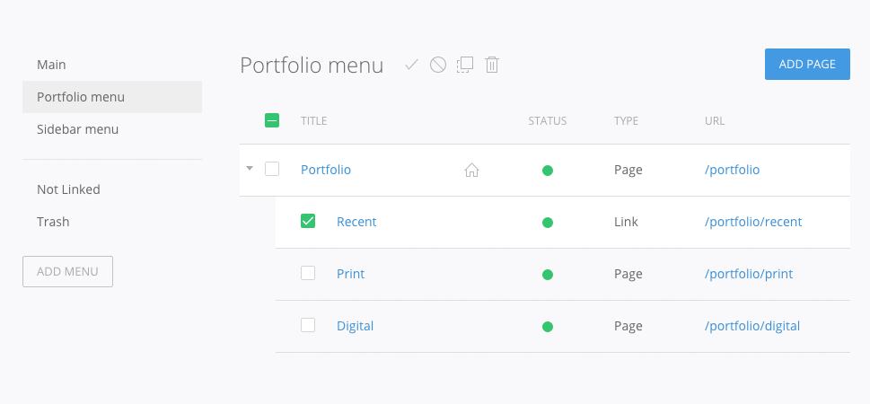
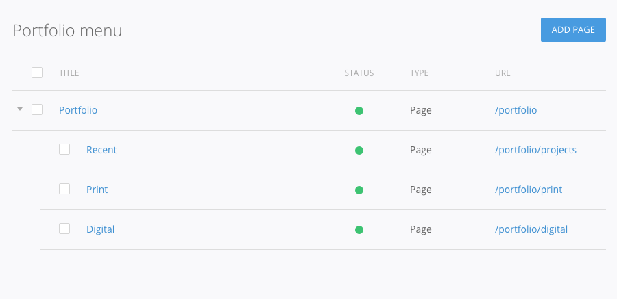
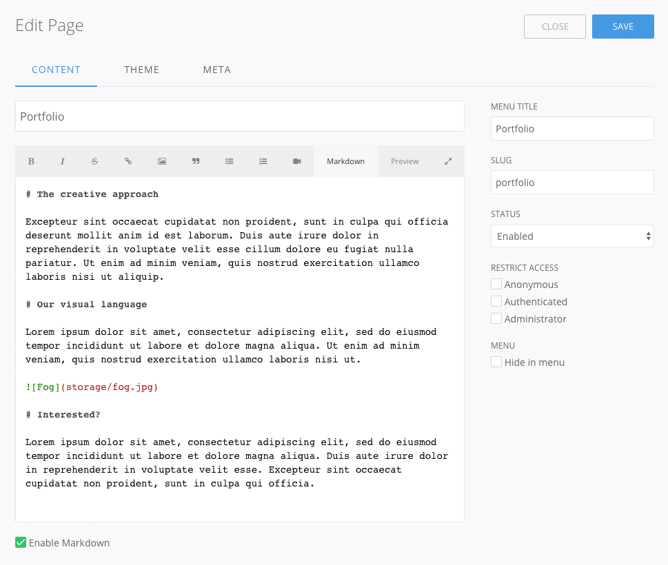
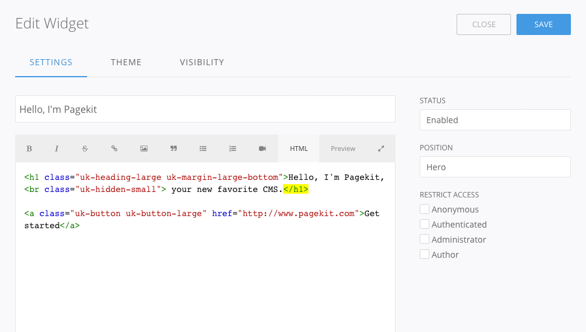
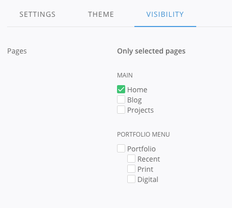

# Site

This area is the heart of your website. Here you can manage pages and menus in a tree view, create and edit widgets, organize all your uploaded media and modify general settings of the site.

<ul class="uk-list uk-list-space">
    <li><a href="#pages-and-menus">Pages and menus</a></li>
    <li><a href="#render-menus">Render menus</a></li>
    <li><a href="#pages">Pages</a></li>
    <li><a href="#widgets">Widgets</a></li>
    <li><a href="#storage">Storage</a></li>
    <li><a href="#settings">Settings</a></li>
</ul>

## Pages and menus
Manage your site's content in the site tree. You can see an overview of all pages in the right and their associated menus in the left column. When hovering a single entry, an _Edit_ and a _Remove_ button will appear for that menu. To create a new menu, hit the _Add Menu_ button. You don't have to create a menu only to navigate through your site. You might also want to use it to group content from your site for easier management in the admin area.

Each menu item and its assigned page is displayed inside the right column. Pages without a menu are listed in the _Not Linked_ view, while trashed pages are listed in the _Trash_ view. Both are accessible below the list of menus.

## Render menus

When you hover over a menu and click the *Edit* icon, a modal dialog will appear. You can rename the menu and assign it to all menu positions defined by your theme. The screenshot below shows a menu that is rendered both in the Main menu position of the site and in the Offcanvas position.

## Pages
Pages can be managed in the tree view on the right hand side of the interface. It shows the hierarchic structure of your page and can be sorted via drag and drop.

To create a new page, hit the _Add Page_ button in the top right hand corner and select the type of page you would like to create. Pagekit comes with a few pre-defined types – any extension can add new types to that list. You can also edit existing pages by clicking on their title in the site tree. This will lead you to an edit screen, which looks different depending on the type of the item you're creating.

When hovering a page, a home icon will appear. Click it to assign the item to the frontpage.

To enable and disable a single item, hit the green or red circle in the status column. This will make it appear or disappear in the rendered menu and make the link unavailable for anyone trying to access the page's URL manually.

The item's type is also displayed in the tree view. Drag an item to the right to make it a submenu. That way you automatically create a hierarchy that generates the item's URL.

Next to each item there’s a checkbox. Enabling the checkbox of one or more items will display a toolbar that offers a number of quick tasks, like moving or deleting a page and enabling or disabling multiple items at once.

### Type: Pages

Pages are basically the equivalent to a static webpage. Typically you would use pages for content like an _About Us_ or _Contact_ page. For editorial content however, you would rather make use of blog posts.

In the **Content** tab you can edit the page main content, such as the article body, title and slug. Additionally you can set the menu title, which will be displayed in the frontend menu as well as the page status and access limitations for certain user roles. The **Settings** tab will display an overview of the page's basic settings. Finally, the **Theme** tab holds the theme specific options.

**Note** A slug is a computer friendly version of the title so that it can be included in the absolute URL to the page. If you do not like the generated slug, simply click on it to choose your own.

### Type: Link
Links are the most flexible type as they can create a menu entry linking to any internal or external URL.

In the **Settings** tab the you can manually fill the URL field. You can also use the link picker by clicking the _select_ button. It allows choosing the extension and view which you want to link to. You can set the link type to be a normal link, an alias of another link or a redirect.

**Note** If you are unsure, leave the default type _Link_.

Like with a static page, the tabs **Settings** and **Theme** offer both system and theme specific settings.

## Widgets
Widgets are a way to render small chunks of content in areas defined by the activated theme. A widget's content can be static (like custom HTML, MArkdown or plaintext) or dynamic (like a slideshow generated by one of your installed extensions).

In the _Site > Widgets_ overview the widgets are sorted by the position they are published in. You can Drag & Drop them to change the rendering order inside a position with multiple widgets. Toggle between enabled and published state by clicking the red or green circle in the _Status_ column.

When one or more widgets are selected, a toolbar appears. Here you can change the status of multiple widgets, as well as duplicate, delete or move them to another position. You can also filter the displayed Widgets with the search field at the top of the screen. This may come on handy when working with a large number of Widgets.

**Note** Be careful when deleting the Widgets as there is no trash to recover them once deleted.

Pagekit comes with the pre-defined widget types _Menu_, _Text_ and _Login_, extensions can add widget types of their own.

### Editing
Click on a Widget title to go to its Edit screen. By default, the _Settings_ tab will be selected. The content of this tab will depend on the widget type. A text widget you will have an editor, a menu widget shows options to select a menu and so on. Every widget type has a set of options available on the right side where you can enable or disable the widget, assign it to a widget position in your theme and restrict its access.

The _Theme_ tab offers settings for the widget's appearance. You can choose a panel style (like a box around the widget's content) or add a badge and center the widget's content. Note that these settings are specific to your activated theme. The following screenshot shows what the default theme will offer here.

The _Visibility_ tab allows you to choose which pages the widget will be rendered on. If no pages are selected, it will be rendered on every page.

## Storage

The Storage tab shows the [Finder](finder.md) which allows to manage your file storage and upload files.

## Settings

_Site > Settings > General_ allows to set general information about your site.

Field        | Description
:----------- | :----------------------------------------------------------------
**Title**    | Your site title.
**Logo**     | The logo that will be displayed as part of your site brand.
**Favicon**  | The image that will be used as the browser favicon.
**App Icon** | The icon that will be used when creating an site shortcut in iOS.

_Site > Settings > Theme_ displays settings from the currently selected theme. The _Theme_ tab might not be visible at all if the active theme doesn't offer or require any settings by the user.

_Site > Settings > Code_ allows setting a code in the header and/or footer of your site. This is useful for tracking codes and manual meta tags.

Field      | Description
:--------- | :-------------------------------------------------------------
**Header** | The code you would like to be displayed in the header section.
**Footer** | The code you would like to be displayed in the footer section.

_Site > Settings > Maintenance_ allows putting your site into maintenance mode and display a related message. As an administrator you will still be able to browser your site. Visitors will only see the maintenance message.

Field       | Description
:---------- | :-----------------------------------------------------------------------------------------------
**Offline** | If enabled the site will enter the maintenance mode and display the text from the message field.
**Message** | The message to be displayed when in maintenance mode.
